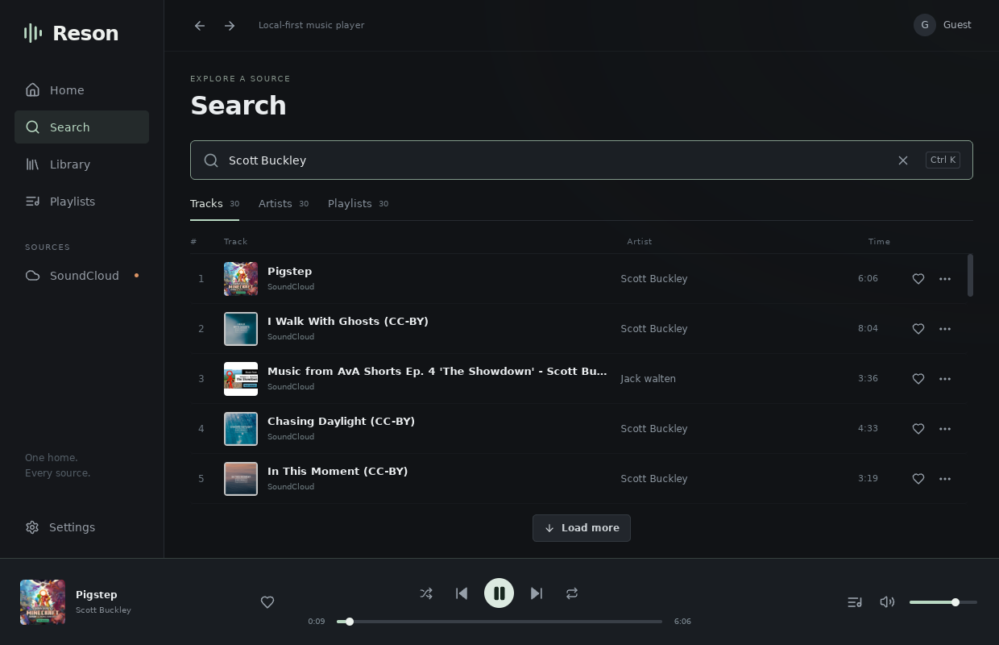

# Reson

A desktop music player that brings multiple music sources into one queue,
library and native playback engine. **v0.1.0 starts with SoundCloud guest
access.** Windows 10/11 x64 · MIT application code.

[Downloads](https://github.com/atlasru/reson/releases) ·
[SoundCloud integration](docs/SOUNDCLOUD.md) ·
[Architecture](docs/ARCHITECTURE.md) · [Roadmap](docs/ROADMAP.md)



Actual native application capture with real SoundCloud results and native
audio playback. [Queue screenshot](docs/images/reson-queue.png).

## Install

Download `Reson_0.1.0_x64-setup.exe` from Releases and run it. The per-user
installer does not require administrator privileges and installs WebView2
when necessary. Or extract **all** files from
`Reson_0.1.0_windows_x64_portable.zip`, then launch `Reson.exe`.

Windows 10/11 x64 and an internet connection for SoundCloud are required.
Builds are unsigned; Windows may show an unknown-publisher prompt. Installer
and portable distributions both store the profile in the normal per-user
application data directory. Keep `libmpv-2.dll` beside the portable executable.

## Features

- Real SoundCloud track, user and playlist search, public charts and related
  tracks. Open SoundCloud links directly from Search.
- Native AAC HLS audio, pause/resume, seek, volume and audio-device selection.
- Queue: add, play next, remove, drag/reorder, clear, previous/next, shuffle,
  repeat queue and repeat track. Duplicate tracks remain distinct entries.
- Reson favorites, recent listening, local playlists and persistent queue,
  position/settings. Restarts restore paused state without surprise autoplay.
- Artist and playlist pages, artwork, context menus and virtualized lists.
- Windows media keys/session metadata, plus desktop keyboard shortcuts.
- Configurable bounded artwork cache and local diagnostic export.
- Optional Discord Rich Presence through local desktop IPC, requiring a
  configured Discord application ID.

| Provider | v0.1.0 support |
| --- | --- |
| SoundCloud | Public guest metadata/search/discovery/playback/users/playlists |
| Yandex Music | Planned for v0.2 |
| Local files | Planned for v0.3 |

SoundCloud login, provider likes/following/private library, Reson accounts,
Discord OAuth and library synchronization are **not delivered**. Reson local
favorites/playlists are separate from a SoundCloud account. Public playback
requires no Reson account. Premium or blocked tracks are not bypassed.

SoundCloud integration currently depends on its **undocumented public web
API**. It can change without notice. All of this dependency is isolated in the
SoundCloud provider; see [research and reliability limits](docs/SOUNDCLOUD.md).

## Controls

Double-click a track to play. Its action menu adds it to the queue, plays it
next, favorites it or adds it to a local playlist. Queue entries support drag
reordering and accessible move/remove buttons. Minimize keeps music playing;
closing exits the application and its audio worker.

| Shortcut | Action |
| --- | --- |
| Space | Play/pause outside text/range inputs |
| Alt ← / → | Previous / next |
| Ctrl K | Search and focus query |
| Ctrl Q | Open/close queue |
| Ctrl ↑ / ↓ | Change volume |
| Media keys | Play/pause, previous/next through Windows SMTC |

## Privacy

Library, listening history, settings, cached metadata and queue stay on your
device in SQLite. Search and stream requests go directly to SoundCloud.
Audio is buffered in memory, never permanently downloaded by normal playback.
Artwork cache defaults to 256 MB and can be resized or cleared in Settings.

This release has **no telemetry endpoint and sends no usage analytics**. Its
random installation UUID is generated locally, never derived from hardware.
Discord presence is off by default and communicates only with the local
Discord desktop client. Logs omit search queries, track metadata, provider
authorizations and transient stream URLs. Diagnostic export stays local until
you choose to share it.

## Architecture

Tauri 2 + React/TypeScript/Vite UI; Rust/Tokio core; SQLite migrations; native
libmpv playback. Rust owns player state, queue, network requests and storage.
The frontend observes events instead of polling and never receives playback
URLs. There is no website embed and no HTML audio engine.

Normalized internal UUIDs are separate from provider IDs. One track can retain
multiple provider sources. `MusicProvider` exposes explicit capabilities and
optional operations, so adding a source principally requires a provider
module and registration. See [the detailed design](docs/ARCHITECTURE.md).

## Development

Prerequisites: Node.js 22/npm, Rust 1.99.0 (pinned), Git and Python 3 for license
collection. On Windows install
Visual Studio Build Tools with **Desktop development with C++**, Windows SDK,
WebView2 and 7-Zip. PowerShell downloads and verifies a pinned LGPL libmpv
archive; no SoundCloud secret or `.env` is required.

```powershell
git clone https://github.com/atlasru/reson.git
cd reson
git switch feature/reson-v0.1.0
npm ci
pwsh -File scripts/prepare-audio.ps1
npm run tauri -- dev
```

For Linux development, install GTK3/WebKitGTK 4.1 development libraries,
build-essential, pkg-config and `libmpv2` (ABI v2); then run `npm ci` and
`npm run tauri -- dev`. Windows is the supported release platform.

```sh
cargo fmt --all --check
cargo clippy --workspace --all-targets --locked -- -D warnings
cargo test --workspace --locked
npm run lint
npm run typecheck
npm test
npm run build
```

Core-only tests need neither a webview nor an audio device:
`cargo test -p reson-core --locked`. Real, internet-dependent native decoding:
`cargo run -p reson-core --example provider_probe`.

## Build and validation

```powershell
pwsh -File scripts/prepare-audio.ps1
python scripts/collect-notices.py
npm run tauri -- build --target x86_64-pc-windows-msvc --bundles nsis
```

The installer is generated under
`target/x86_64-pc-windows-msvc/release/bundle/nsis/`. GitHub Actions runs Rust
format/clippy/tests, frontend lint/typecheck/tests/build and Windows x64
packaging. It assembles installer/portable artifacts with SHA-256 sums and
tests real SoundCloud decoding from both portable and freshly installed builds.
Find artifacts on a **successful** Actions run; a failed run is not a validated
release. Physical Windows speakers/media overlays require desktop testing.

Tests cover normalized parsing/availability, malformed/oversized HTTP input,
request cancellation and rate limits, optional provider
capabilities, queue operations/repeat/shuffle, source refresh, network failure,
SQLite migration/reopen, cache limits, configuration and player gestures.

See [recorded real playback and restart validation](docs/VALIDATION.md) and
`scripts/validate-desktop.py` for repeatable native UI checks.

## Contributing

Use a feature branch, run the checks above, and open a focused pull request.
Keep provider-specific formats inside provider modules, never commit tokens or
cookies, and include real playback evidence for streaming changes. Report
issues with version/platform and a redacted local diagnostic export; do not
include access tokens or private library data.

## License

[MIT](LICENSE) for Reson application code. The unmodified replaceable LGPL
libmpv/FFmpeg DLL and its license texts/notices ship with Windows builds.
[Third-party notices](src-tauri/resources/THIRD_PARTY_NOTICES.md) identify the
pinned binary, upstream sources and build recipes.
