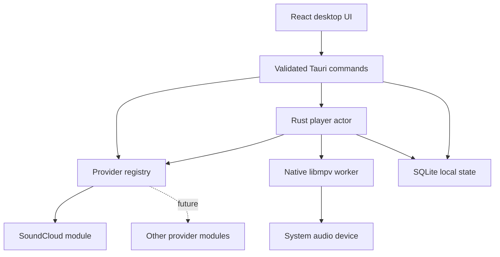

# Architecture

Reson has three boundaries: desktop shell/UI, provider-neutral core, and
external providers. React observes the Rust core; it never owns playback.

## Core

- `models`: internal UUIDs, normalized tracks/artists/playlists, multiple track
  sources, explicit availability. Provider references are separate keys.
- `providers`: async `MusicProvider`, registry and explicit capabilities.
  Optional operations return `Unsupported`; no provider is forced to support
  authentication or library writes. Adding a provider principally means a new
  module and registration in the desktop composition root.
- `audio`: single native worker owns libmpv and its dynamically loaded ABI v2
  library. Commands and native notifications cross channels; its worker blocks
  while idle. Native TLS verification stays enabled. Decoder/stream buffers
  are bounded in memory; audio is not permanently cached.
- `player`: one Rust actor owns playback, queue commands, source resolution,
  cancellation generations, retry state and persistence. Position updates
  are throttled to about twice a second during playback. Loading has a timeout;
  unavailable tracks are boundedly skipped, network outages stop playback.
- `queue`: stable entry UUIDs permit duplicate tracks; display ordering and
  shuffle ordering are separate. Repeat-track applies to natural completion;
  an explicit Next moves forward. Maximum 5,000 entries.
- `storage`/`library`: bundled SQLite with WAL and transactional migrations.
  Provider references normalize to stable internal IDs across requests. Queue,
  position, settings, favorites, local playlists and recent history survive
  restarts. Resume is explicit after restart. History is bounded to 1,000
  records; unreferenced track metadata is bounded to 10,000 recent tracks.
- `cache`: hashed artwork files, bounded image responses and disk LRU cleanup.
  Default 256 MB, configurable 32–2,048 MB. No audio download feature.

## Desktop

Tauri exposes application-specific commands only. The frontend receives
normalized metadata and snapshots, never transient playback URLs or provider
authorizations. CSP excludes frames/remote scripts, and the asset protocol is
scoped to artwork cache files. The frontend has no filesystem, process or
shell plugin permissions.

Player and queue snapshots have separate event channels, so position changes
do not transfer or re-render the whole queue. Track and queue lists are
virtualized. Search is debounced/cancellable; requests do not originate in the
webview. Artwork is lazy and cached through Rust.

`src-tauri/src/windows` bridges the core to Windows SMTC through souvlaki;
media keys, metadata and timeline operate independently of page focus.
Minimizing leaves playback active. Closing the application shuts down the
player and native worker; no mpv subprocess is created.

`src-tauri/src/discord` uses local Discord IPC, is disabled by default and
requires a Discord application ID. It never forwards playback to a server.

## Accounts and telemetry

Guest mode is the only account mode in v0.1.0. A random installation UUID and
minimal installation metadata live locally. Provider/account tables reserve
future identity boundaries but do not implement authentication. No backend,
OAuth service, synchronization or telemetry endpoint is shipped. There are no
embedded production secrets. Account functionality can be added independently
of public playback.

## Diagnostics

Structured JSON logs record categories, status codes and timing. They exclude
queries, listening metadata, authorizations, access tokens and stream URLs.
Three rotated local log files are retained. Settings exports bounded logs and
app/platform information to a fixed application diagnostics directory.
